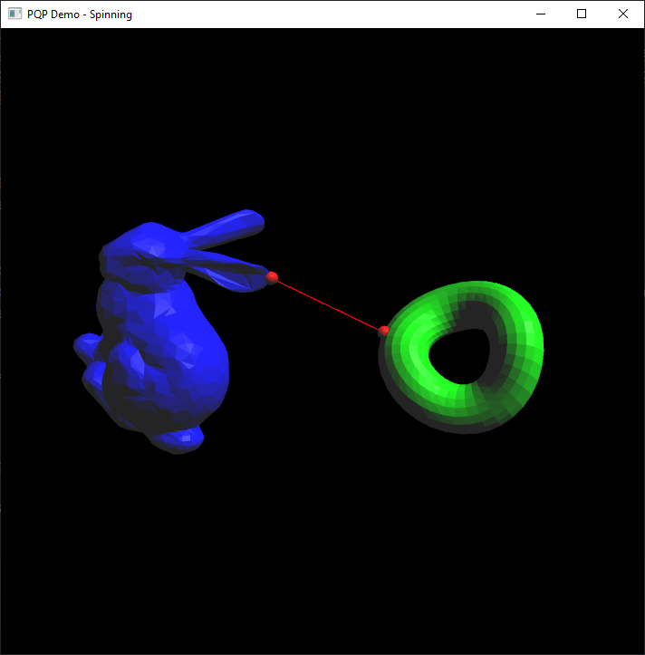

# PQP

###### [http://gamma.cs.unc.edu/SSV/](http://gamma.cs.unc.edu/SSV/)

###### Authored by Eric Larsen and Stefan Gottschalk

###### UNC - Chapel Hill Computer Science

###### geom (at) cs (dot) unc (dot) edu

[](https://github.com/timow-gh/PQP/actions/workflows/windows.yml)
[](https://github.com/timow-gh/PQP/actions/workflows/linux.yml)

| Version | Changes                                                                                                                                  |
|---------|:-----------------------------------------------------------------------------------------------------------------------------------------|
| 1.3     | now use isnan() to test for NaN, instead of a comparison that was sometimes optimized away.                                              
| 1.2     | Altered the triangle distance routine due to a degeneracy problem when edges of two triangles nearly intersect.                          
| 1.1     | Fixed a bug in calculating query times on Win32 machines. Added a demo 'falling' which can demonstrate all of the proximity query types. 
| 1.0     | First release of library                                                                                                                 

## Introduction

PQP, which stands for Proximity Query Package, is a library for three
types of proximity queries performed on geometric models composed of
triangles:

* collision detection - detect whether two models overlap, and optionally, which triangles of the models overlap.
* distance computation - compute the distance between two models, i. e., the length of the shortest translation that
  makes the models overlap
* tolerance verification - detect whether two models are closer or farther than a tolerance value.

By default, the library uses "RSS" bounding volumes for distance and
tolerance queries, and OBBs for collision detection (see `PQP_Compile.h`).
Descriptions of the bounding volumes and algorithms used in this package
are contained in:

- [Fast Proximity Queries with Swept Sphere Volumes](http://gamma.cs.unc.edu/SSV/ssv.pdf)
  <br>Eric Larsen, Stefan Gottschalk, Ming C. Lin, Dinesh Manocha
  <br>Technical report TR99-018, Department of Computer Science
  <br>UNC Chapel Hill

- [OBB-Tree: A Hierarchical Structure for Rapid Interference Detection](http://gamma.cs.unc.edu/SSV/obb.pdf)
  <br>Stefan Gottschalk, Ming C. Lin and Dinesh Manocha
  <br>Technical report TR96-013, Department of Computer Science, University of North Carolina, Chapel Hill.
  <br>Proc. of ACM Siggraph'96.

## Layout of Files

```
 PQP_v1.3/
   src/
     PQP source

   lib/             
     libPQP.a         after Unix compilation
     PQP.lib          after Win32 compilation

   include/
     PQP.h            include this file to use PQP classes and functions.
     PQP_Internal.h   
     PQP_Compile.h    *WARNING* you should only modify PQP_Compile.h in
     Tri.h            the src directory, not here, because these files
     BV.h             are copied here from src when you perform a build
                     
   demos/
     falling/         source and project files
     sample/          "      "   "       "
     spinning/        "      "   "       "
```

## Building the PQP Library

The library can be built using CMake. For the demos to be built, set the option `${PROJECT_NAME}_BUILD_SAMPLES` to `ON`.

### Demo applications

- **sample**

  This demo is adapted from the sample client included with RAPID. Two
  tori are created, and proximity queries are performed on them at  
  several configurations

- **spinning**

  The spinning demo is a GLUT application, so paths to the GLUT & OpenGL
  libraries and includes must be set in spinning/Makefile, or in the
  VC++ project settings. When run, a bunny and a torus should appear in
  the GLUT window, with a line drawn between their closest points.
  Pressing a key alternately starts and stops them spinning.

- **falling**

  This demo is also a GLUT application, showing a bent torus
  falling through the center of a knobby torus. Each of the three
  proximity query types can be demonstrated.

<div style="text-align: center;">
  <h3>Spinning Demo</h3>
  
</div>

### Build options

The following options can be set to control the build:

- `BUILD_SHARED_LIBS` - Set to `ON` to build the shared library.
- `CMAKE_CXX_STANDARD` - Set the C++ standard. Default is `23`.
- `${PROJECT_NAME}_BUILD_SAMPLES` - Set to `ON` to build the demos.
- `${PROJECT_NAME}_INSTALL` - Set to `ON` to install the library.
- `INSTALL_PREFIX` - If the library is installed, use this to set the install location. Default is `/usr/local`.
- `${PROJECT_NAME}_PACKAGE` - Set to `ON` to create a package.

### Build steps

First, configure the project using CMake for windows or unixlike systems.

### Configure step Ubuntu

Requirements, install before building:

```text
  clang-11 libc++-11-dev libc++abi-11-dev ninja-build libxi-dev libgl1-mesa-dev libglu1-mesa-dev ninja-build
  CMake 3.21 or older
```

```bash
cmake   -B $BUILD_DIR -S $SOURCE_DIR -G Ninja \
        --preset "unixlike-clang-release" \
        -DBUILD_SHARED_LIBS=OFF \
        -DCMAKE_CXX_STANDARD=20 \
        -D${PROJECT_NAME}_BUILD_SAMPLES=OFF \
        -D${PROJECT_NAME}_INSTALL=OFF \
        -D${PROJECT_NAME}_PACKAGE=OFF
```

### Configure step windows

If ths project is the top level cmake project, the demos are built by default. Use the
option `${PROJECT_NAME}_BUILD_SAMPLES` to control this behavior.

Requirements, install before building:

```text
  A current Visual Studio versions
  CMake 3.21 or older
```

```batch
// Configure step:
cmake   -B <build-dir> -S <source-dir> ^
        --preset windows-msvc-release ^
        -DBUILD_SHARED_LIBS=OFF ^
        -DCMAKE_CXX_STANDARD=20 ^
        -D${PROJECT_NAME}_BUILD_SAMPLES=OFF ^
        -D${PROJECT_NAME}_INSTALL=OFF ^
        -D${PROJECT_NAME}_PACKAGE=OFF
```

### Building the project

```bash
// Build step, specify your number of cores
cmake --build <build-dir>  --config Release --parallel --parallel <no-of-cores>

// Install step, if you configured to install the library:
cmake --install <build-dir> --config Release
```

## Creating a PQP Client Application

`PQP.h` contains the most complete information on constructing client
applications. Here is a summary of the steps involved.

1. Include the PQP API header.

   ```
   #include "PQP.h"
   ```

2. Create two instances of `PQP_Model`.

   ```
   PQP_Model m1, m2;
   ```

3. Specify the triangles of each `PQP_Model`. Note that PQP uses the `PQP_REAL` type for all its floating point
   values. This can be set in "PQP_Compile.h", and is "double" by default

   ```
   // begin m1
   m1.BeginModel();
   
   // create some triangles
   PQP_REAL p1[3], p2[3], p3[3];  
   PQP_REAL q1[3], q2[3], q3[3];
   PQP_REAL r1[3], r2[3], r3[3];
   
   // initialize the points
    .
    . 
    .  
   
   // add triangles that will belong to m1
   m1.AddTri(p1, p2, p3, 0);
   m1.AddTri(q1, q2, q3, 1);
   m1.AddTri(r1, r2, r3, 2);
   
   // end m1, which builds the model
       
   m1.EndModel();
   ```

4. Specify the orientation and position of each model.

   The position of a model is specified as a 3 vector giving the
   position of its frame in the world, stored in a `PQP_REAL [3]`.

   The rotation for a model is specified as a 3x3 matrix, whose columns
   are the model frame's basis vectors, stored in row major order in
   a `PQP_REAL [3][3]`;

   Note that an OpenGL 4x4 matrix has column major storage.

5. Perform any of the three proximity queries.

   ```
   // collision

   PQP_CollideResult cres;
   PQP_Collide(&cres,R1,T1,&m1,R2,T2,&m2);

   // distance

   PQP_DistanceResult dres;
   double rel_err = 0.0, abs_err = 0.0;
   PQP_Distance(&dres,R1,T1,&m1,R2,T2,&m2,rel_err,abs_err);

   // tolerance

   PQP_ToleranceResult tres;
   double tolerance = 1.0;
   PQP_Tolerance(&tres,R1,T1,&m1,R2,T2,&m2,tolerance);
   ```

   See "PQP.h" for complete information.

6. Access the result structure passed in the query call.

   ```
   int colliding = cres.Colliding();
   double distance = dres.Distance();
   int closer = tres.CloserThanTolerance();
   ```

See "PQP.h" for the complete interface to each result structure.
